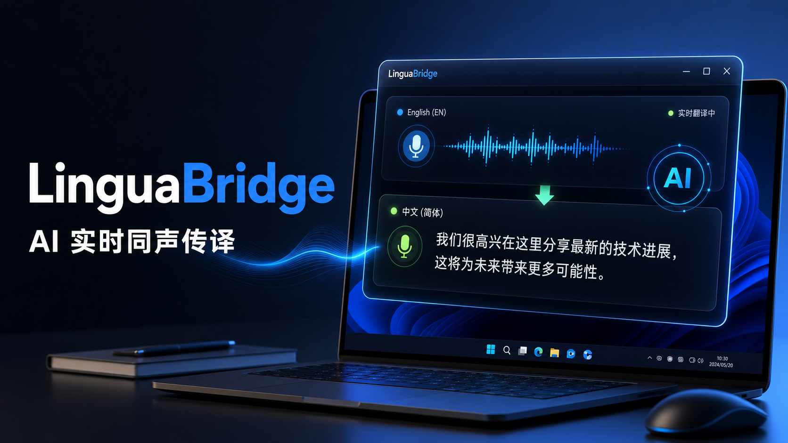

# LinguaBridge · 言桥

<p align="center">
  <a href="./LICENSE"></a>
  
  
</p>

> **面向专业课程的 AI 实时同声传译工具** — 让英文计算机课程、技术分享和国际会议像中文内容一样顺畅可学。



<p align="center">
  <strong>🎬 产品演示视频</strong> · <a href="https://www.bilibili.com/video/BV1iVEs6LEr9">Bilibili 演示</a>
</p>

<p align="center">
  <a href="https://www.bilibili.com/video/BV1iVEs6LEr9" title="点击观看 LinguaBridge 演示视频">
    
  </a>
</p>

---

## 项目简介

言桥是一款面向中文学习者的 **PC 端 AI 同声传译工具**，专为英文计算机课程打造。它通过 WASAPI Loopback **捕获系统音频**，经 **实时语音识别 → 机器翻译 → 上下文纠错** 后，以 **置顶浮窗字幕** 呈现翻译结果。

> 🔑 **无需平台字幕接口**，任何在电脑上播放的英文音频都能实时转译。

当前聚焦 **英 → 中同传**，后续将扩展至医学、金融、法律等更多专业场景。

## 核心特性

- 🔊 **系统音频捕获** — WASAPI Loopback 采集任意应用输出音频，浏览器、播放器、会议软件 **全覆盖**
- ⚡ **低延迟同传** — `draft → final → revised` **三级渐进式翻译**，课程进行中即可跟上语义
- 🔄 **上下文纠错** — 每 15–30 秒扫描近期上下文，**自动修正**歧义与误译，UI 仅更新当前段避免字幕跳动
- 📚 **300+ 术语库** — 覆盖云原生、AI/ML、编程语言、前端、DevOps 等，技术词一致率 **≥ 90%**
- 🖥️ **桌面浮窗** — 可拖动、锁定、调整字号与透明度，支持 **中英双语 / 纯中文** 显示模式
- 💾 **会话落盘与导出** — 音频、原文、译文、修订历史 **全部结构化存储**，支持 Markdown / SRT / JSON 导出

## 技术架构

```
┌─────────────────────────┐     WebSocket      ┌──────────────────────────┐
│   Desktop App (Tauri)   │ ◄────────────────► │   Realtime Gateway       │
│                         │    audio frames     │   (Node.js + Fastify)    │
│  ┌───────────────────┐  │    subtitle events  │                          │
│  │  React Frontend   │  │                     │  ┌────────────────────┐  │
│  │  (TypeScript)     │  │                     │  │  Subtitle Engine   │  │
│  └───────────────────┘  │                     │  │  draft→final→rev   │  │
│                         │                     │  └────────────────────┘  │
│  ┌───────────────────┐  │                     │                          │
│  │  Rust Audio Core  │  │                     │  ┌────────────────────┐  │
│  │  (WASAPI Loopback)│  │                     │  │  Model Sessions    │  │
│  └───────────────────┘  │                     │  │  ASR + MT / LiveT  │  │
└─────────────────────────┘                     │  └────────────────────┘  │
                                                │                          │
                                                │  ┌────────────────────┐  │
                                                │  │  Session Storage   │  │
                                                │  │  (PostgreSQL/OSS)  │  │
                                                │  └────────────────────┘  │
                                                └──────────────────────────┘
```

| 层级 | 技术栈 |
| :---: | --- |
| 🖥️ **客户端** | Tauri v2 + React 19 + TypeScript |
| 🔊 **音频** | Rust · Windows WASAPI Loopback |
| 🌐 **网关** | Node.js 22 + Fastify + WebSocket |
| 🤖 **模型** | 阿里云 ASR（Paraformer）+ Qwen-MT + LiveTranslate |
| 🗄️ **存储** | PostgreSQL + 阿里云 OSS |

## 快速开始

> ⚙️ **环境要求**：**Node.js ≥ 22** · Rust 工具链（Windows）

```bash
git clone https://github.com/JiaWei-Chen-2295/LinguaBridge.git
cd LinguaBridge
npm install

# 启动实时网关（默认 ws://127.0.0.1:4318）
npm run dev:gateway

# 启动桌面客户端（Tauri 窗口）
npm run dev:desktop

# 仅前端网页预览
npm run dev:desktop:web
```

> 📖 开发前请阅读 [AGENTS.md](./AGENTS.md) 了解项目上下文与代码规范。

<details>
<summary><strong>📂 项目结构</strong></summary>

```
lingua-bridge/
├── apps/
│   ├── desktop/          # Tauri v2 桌面客户端
│   │   ├── src/          # React 前端（TypeScript）
│   │   │   ├── views/    # MainWindow / OverlayWindow
│   │   │   ├── services/ # Gateway 对接、音频控制
│   │   │   └── components/
│   │   └── src-tauri/    # Rust 核心（WASAPI 音频采集）
│   └── gateway/          # Node.js 实时网关服务
│       └── src/
│           ├── realtime/  # 字幕引擎、模型会话
│           ├── http/      # REST API
│           └── storage/   # 数据库与对象存储
├── packages/
│   ├── protocol/         # 共享协议类型定义
│   └── mock-models/      # 开发/测试用模拟模型
└── docs/                 # 产品文档与技术选型
```

</details>

## 文档

- 📋 [MVP 产品需求文档](./docs/prd-mvp-ai-realtime-subtitle.md)
- 🔧 [MVP 技术选型](./docs/technical-selection-mvp.md)
- 🤝 [项目协作规范](./AGENTS.md)

## 路线图

| 阶段 | 内容 | 状态 |
| --- | --- | --- |
| **Phase 0** | 技术 Spike（WASAPI 采集、模型链路对比、成本测算） | ✅ 完成 |
| **Phase 1** | MVP Alpha（桌面客户端、同传字幕、网关、术语库、纠错引擎、会话落盘、邀请码） | ✅ 完成 |
| **Phase 2** | 邀请码内测（20–50 名技术学习者，验证同传体验与设备兼容性） | 📅 计划 |
| **Phase 3** | 专业课程扩展（领域术语库、课程级导出与复盘） | 📅 计划 |
| **Phase 4** | 付费验证（Free/Pro 套餐、订阅支付、额度系统） | 📅 计划 |

## 致谢

LinguaBridge 使用了 [Tauri、React、Fastify](./ACKNOWLEDGMENTS.md) 等优秀的开源项目，完整致谢详见 [ACKNOWLEDGMENTS.md](./ACKNOWLEDGMENTS.md)。

## 许可证

本项目基于 [Apache License 2.0](./LICENSE) 开源。
