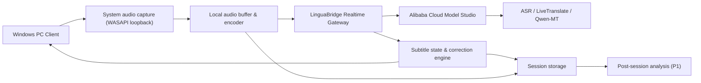

# LinguaBridge MVP PRD: PC 端 AI 实时字幕与翻译伴学工具

版本：v0.3  
调研日期：2026-06-05  
更新依据：产品确认首发 PC 端、系统音频录制、英中优先并预留扩展、允许并要求落盘、先做字幕纠错、个人订阅、MVP 先做邀请码 + 用量统计  
模型约束：MVP 阶段只能使用阿里云模型与服务  
目标用户：中文技术学习者，主要观看英文技术课程、技术演讲、国际会议、直播、网课或外语技术内容

## 1. 产品定义

LinguaBridge 是一款面向中文技术学习者的 PC 端 AI 伴学工具。用户在电脑上播放英文技术视频、直播、会议回放或网课时，客户端录制系统音频，实时生成英文原文与中文字幕；系统会基于后续上下文自动修正上一段识别或翻译错误，并将音频、原文、译文、修订历史落盘，供后续精读解析、笔记生成和课程复盘使用。

## 2. 已确认决策

| 决策项 | 当前结论 | 对 MVP 的影响 |
| --- | --- | --- |
| 首发形态 | PC 桌面端优先 | 不再以浏览器插件作为 MVP 主形态；后续保留浏览器扩展入口。 |
| 音频来源 | 录制系统音频 | 产品可覆盖浏览器、播放器、会议软件、本地视频等来源。 |
| 语言方向 | 英文 -> 简体中文优先 | 架构预留多语种输入与多目标语言，不在 MVP 扩大评测范围。 |
| 数据策略 | 允许上传阿里云，并要求落盘 | MVP 需要会话存储、音频文件管理、隐私授权、删除机制。 |
| 首发输出 | 先做实时字幕 | 语音同传进入 P1/P2，不阻塞 MVP。 |
| 核心差异 | 字幕可自行纠错 | 字幕状态、修订窗口、术语表与 transcript 版本管理是 P0。 |
| 首发平台 | Windows 10/11 | macOS 作为 P1 扩展；MVP 先把 Windows 系统音频捕获做稳。 |
| 内测准入 | 邀请码 + 用量统计 | MVP 不接正式支付；先验证留存、时长、成本和付费意愿。 |
| 数据保留 | 本地缓存 + 云端对象存储，默认 30 天 | MVP 必须提供用户可见的会话历史和删除入口；暂不提供“关闭云端保存”。 |
| 商业模式 | 个人订阅 | Alpha 先不收费，Phase 3 再接 Pro 订阅与支付。 |

## 3. 调研结论

### 3.1 市场与竞品判断

2026 年实时字幕/翻译能力已经不是空白市场。Zoom、Google Meet、Microsoft Teams 等会议产品已提供实时字幕或翻译字幕，但它们被绑定在各自会议场景内；浏览器字幕插件和视频翻译插件多围绕 YouTube、字幕轨道或网页插件工作；Notta 等转录工具证明了音频录制 + 实时转写的用户路径成立。

LinguaBridge 的机会不在“又做一个翻译字幕”，而在以下组合：

- PC 系统级音频捕获：覆盖浏览器、网课客户端、会议软件、本地播放器，不依赖平台字幕接口。
- 技术学习专用：术语一致、英文对照、课后 transcript、后续精读解析。
- 实时纠错体验：允许先出草稿，再基于上下文修订最近字幕和最终笔记。
- 个人订阅：面向高频自学者、程序员、研究生、技术岗位求职者，不先做复杂企业流程。

### 3.2 阿里云能力可支撑 MVP

| 能力 | 可用模型/服务 | 关键结论 | MVP 用法 |
| --- | --- | --- | --- |
| 实时语音识别 | `qwen3-asr-flash-realtime`、`fun-asr-realtime`、`paraformer-realtime-v2` | 阿里云 Model Studio 文档显示实时 ASR 可通过 WebSocket 处理流式音频并返回流式文本；Qwen-ASR 更偏大模型识别，Fun-ASR/Paraformer 在热词、时间戳等字幕工程能力上需要实测。 | Phase 0 同时评估 Qwen-ASR 与 Paraformer/Fun-ASR；若需要稳定时间戳和热词，优先选择支持更完整字幕元数据的链路。 |
| 实时音视频翻译 | `qwen3.5-livetranslate-flash-realtime` | 2026 文档显示该模型支持多语种实时翻译，可输出译文文本与音频，并可配置返回原文识别结果。 | 必须做技术 Spike；若延迟与术语表现合格，可作为低延迟主链路。 |
| 机器翻译 | `qwen-mt-flash`、`qwen-mt-lite`、`qwen-mt-plus` | Qwen-MT 支持多语种、术语干预、领域提示、翻译记忆；`qwen-mt-flash` 支持增量流式输出。 | ASR + MT 组合链路中使用 `qwen-mt-flash`；课后精修可用更高质量模型。 |
| 课后解析 | Qwen 系列文本模型 + 会话落盘内容 | 落盘后的音频、ASR、译文和修订历史可用于生成学习笔记、术语表、摘要和问答。 | MVP 只保留数据结构和导出；深度解析进入 P1。 |

### 3.3 PC 系统音频采集可行性

MVP 确认首发 Windows 10/11，macOS 作为预留扩展位。

| 平台 | 采集方案 | 结论 | MVP 建议 |
| --- | --- | --- | --- |
| Windows 10/11 | WASAPI loopback | Microsoft 文档说明 WASAPI loopback 可捕获渲染端点正在播放的音频流，适合系统音频录制。 | P0 首发；需要处理默认输出设备切换、蓝牙耳机、独占模式、采样率转换。 |
| macOS | ScreenCaptureKit | Apple 文档显示 ScreenCaptureKit 支持采集屏幕与音频内容，系统音频捕获需要权限说明。 | P1 预留；若要首发同时覆盖 macOS，开发与测试成本会上升。 |
| 浏览器扩展 | Chrome `tabCapture` | 可捕获当前标签页音频，但覆盖范围弱于 PC 系统音频。 | P1/P2 作为轻量入口或获客渠道，不作为 MVP 主路径。 |

## 4. MVP 产品目标

### 4.1 目标

1. 用户在 Windows PC 上打开任意英文技术内容后，点击客户端“开始伴学”，即可看到实时中文字幕。
2. 支持系统音频录制，不依赖播放器、浏览器或会议平台的字幕接口。
3. 支持英文原文 + 中文译文双语字幕，中文优先，英文可折叠。
4. 支持字幕自纠错：当前段先出草稿，句末稳定，后续上下文到达后可修订最近字幕。
5. 支持会话落盘：保存音频、分段原文、分段译文、修订记录、术语命中和导出文件。
6. 支持邀请码内测、个人账号和用量统计，为后续个人订阅做准备。

### 4.2 非目标

MVP 不做以下能力：

- 不首发移动端。
- 不首发语音同传，先确保字幕实时性、准确性和可纠错。
- 不做双向会议翻译，只处理用户电脑正在播放的单向音频流。
- 不承诺所有 DRM/受保护音频都能捕获。
- 不做复杂团队管理、企业合规后台和团队术语库。
- 不做全语种评测；仅预留多语种扩展接口。

## 5. 用户画像与核心场景

### 5.1 首发用户

| 用户 | 典型内容 | 痛点 | MVP 价值 |
| --- | --- | --- | --- |
| 中文程序员/学生 | YouTube 技术演讲、conference talk、开源项目发布会 | 英文听力跟不上，术语密集，暂停查词破坏节奏 | 实时双语字幕 + 技术术语稳定翻译 |
| 转岗/自学技术学习者 | Coursera、Udemy、edX、公开课 | 课程原字幕质量不稳定，中文翻译滞后 | 无需平台字幕，直接从系统音频生成中文字幕 |
| 技术从业者 | 海外 webinar、供应商培训、线上 workshop | 平台内置字幕受限，内容无法复盘 | 实时字幕 + 会话落盘 + transcript 导出 |

### 5.2 核心用户故事

1. 作为中文技术学习者，我希望在电脑上播放任何英文技术内容时，都能用一个桌面浮窗看到中文字幕。
2. 作为学习者，我希望字幕能先快速出现，即使一开始不完美，也能在几秒内自动修正。
3. 作为学习者，我希望技术词、框架名、API 名称不要被乱翻译。
4. 作为学习者，我希望课程结束后能查看本次音频、原文、译文和修订后的 transcript。
5. 作为付费用户，我希望清楚知道自己用了多少实时字幕时长，还剩多少额度。

## 6. MVP 功能范围

### 6.1 P0 功能

| 模块 | 功能 | 说明 | 验收标准 |
| --- | --- | --- | --- |
| 桌面客户端 | 开始/暂停/停止伴学 | 常驻托盘 + 主窗口 + 字幕浮窗。 | 点击开始后 3 秒内进入“正在听”；停止后释放音频设备与网络连接。 |
| 系统音频录制 | 捕获系统输出音频 | Windows 使用 WASAPI loopback；不默认录制麦克风。 | 浏览器、播放器、会议软件播放音频时可捕获；耳机/扬声器切换后有提示或自动恢复。 |
| 实时字幕 | 中文主字幕 + 英文原文 | 桌面置顶浮窗，支持拖动、锁定、透明度、字号、单行/双行模式。 | 字幕不遮挡主要内容；稳态中文延迟 P50 <= 4 秒。 |
| 字幕纠错 | `draft/final/revised` 状态 | 当前段先出草稿；句末变稳定；最近 1-2 段可被上下文修订。 | 修订发生时轻量提示，不造成大幅跳动；修订记录可在 transcript 中追溯。 |
| 术语表 | 内置技术术语 + 用户自定义 | 首批 100-300 个技术词；支持保留英文、固定译法、别名。 | 常见技术词一致率 >= 90%。 |
| 会话落盘 | 音频与文本结构化保存 | 保存原始/压缩音频、ASR 分段、译文、修订历史、术语命中、模型元数据。 | 停止后可在历史会话中查看；用户可删除本地与云端数据。 |
| 导出 | Markdown、SRT、JSON | Markdown 用于学习笔记，SRT 用于字幕复用，JSON 用于后续解析。 | 导出内容包含时间、原文、译文、修订后文本。 |
| 邀请码准入 | 邀请码激活、账号绑定 | 用户通过邀请码进入 Alpha；邀请码记录来源、批次、额度和有效期。 | 无邀请码不可使用云端实时字幕；后台可查看激活与使用情况。 |
| 用量统计 | 实时字幕分钟数、存储、模型调用成本 | 记录 ASR 时长、翻译 token、修订 token、云端存储容量。 | 用户可看到本月已用分钟数；后台可按用户和邀请码批次统计成本。 |
| 隐私授权 | 首次使用明确告知 | 告知系统音频会上传阿里云并落盘，用于实时字幕和后续解析。 | 用户确认后才可开始录制；提供数据删除入口。 |

### 6.2 P1 功能

- 课后精读解析：章节摘要、重点概念、术语卡片、代码/API 名称提取。
- macOS 客户端：基于 ScreenCaptureKit 采集系统音频。
- 多语种输入：日语、韩语、德语等；目标语言默认中文。
- 浏览器扩展：作为轻量模式或获客入口，捕获当前标签页音频。
- 语音同传：使用阿里云实时翻译或 TTS，但需先验证延迟、成本和原声混音体验。
- 字幕智能定位：自动避开全屏播放器字幕/控件区域。

## 7. 推荐技术方案

### 7.1 MVP 架构



### 7.2 客户端建议

MVP 可选技术路线：

| 方案 | 优点 | 风险 | 建议 |
| --- | --- | --- | --- |
| Electron + 原生音频模块 | UI 开发快，桌面浮窗和账号页面实现快。 | 包体较大，Windows 音频模块仍需原生封装。 | 适合快速验证商业 MVP。 |
| Tauri + Rust 音频采集 | 包体小，性能好，Rust 适合音频流处理。 | 前期工程复杂度更高，跨平台音频封装要投入。 | 若团队熟 Rust，可作为更长期方案。 |
| 原生 Windows 客户端 | 音频与浮窗控制最稳定。 | 研发速度慢，跨平台成本高。 | 不建议作为第一版，除非团队强 Windows 原生。 |

推荐：Electron/Tauri 二选一，但音频采集层独立封装，避免未来迁移成本。无论 UI 框架怎么选，核心音频模块都应抽象为：

```text
AudioCapture.start(deviceId?, sampleRate, channels)
AudioCapture.onFrame(pcmFrame)
AudioCapture.onDeviceChanged(event)
AudioCapture.stop()
```

### 7.3 模型链路建议

Phase 0 必须验证两条链路：

| 链路 | 说明 | 优点 | 风险 |
| --- | --- | --- | --- |
| A. LiveTranslate 直连 | 系统音频 -> 后端 -> `qwen3.5-livetranslate-flash-realtime`，同时拿原文和译文。 | 链路短，天然适合同传，未来可扩展语音输出。 | 术语控制、字幕分段、修订粒度需实测。 |
| B. ASR + Qwen-MT | 系统音频 -> `qwen3-asr-flash-realtime`/Fun-ASR/Paraformer -> `qwen-mt-flash`。 | 术语表、翻译记忆和领域提示更可控；便于做修订窗口。 | 两段调用可能增加延迟；ASR 术语误识别仍需处理。 |

推荐默认实现链路 B，因为产品核心是技术学习、术语稳定和可纠错；链路 A 作为延迟优化和未来语音同传扩展保留。

### 7.4 落盘数据设计

MVP 需要同时支持实时字幕和后续精读解析，因此落盘不能只保存最终译文。

```json
{
  "sessionId": "sess_20260605_001",
  "userId": "user_001",
  "sourceLang": "en",
  "targetLang": "zh-CN",
  "audio": {
    "localPath": "sessions/sess_001/audio.opus",
    "cloudObjectKey": "users/user_001/sessions/sess_001/audio.opus",
    "durationMs": 1830000,
    "sampleRate": 16000
  },
  "segments": [
    {
      "segmentId": "seg_001",
      "sourceText": "We deploy it on Kubernetes with a sidecar proxy",
      "zhText": "我们将它部署在 Kubernetes 上，并使用 sidecar 代理",
      "status": "revised",
      "startAtMs": 12030,
      "endAtMs": 15880,
      "revisionOf": "seg_001_v1",
      "confidence": 0.86,
      "termsHit": ["Kubernetes", "sidecar proxy"]
    }
  ],
  "modelTrace": {
    "asrModel": "qwen3-asr-flash-realtime",
    "mtModel": "qwen-mt-flash"
  }
}
```

建议存储策略：

- 音频：客户端本地缓存 + 云端对象存储；默认压缩为 Opus 或 AAC，保留 PCM 只用于短时实时缓冲。
- 文本：结构化存储 ASR 初稿、最终稿、译文初稿、译文修订稿。
- 修订历史：保留每段 revision，方便后续评估纠错效果。
- 删除能力：用户可删除单个会话；删除后云端音频、文本和索引都应清除。
- 保留周期：MVP 统一默认 30 天；后续 Free/Pro 可扩展为 7/180 天。
- 云端保存开关：MVP 暂不提供关闭云端保存，因为后续仔细解析依赖落盘数据；后续可作为隐私模式单独设计。

### 7.5 字幕纠错机制

字幕对象状态：

- `draft`：实时流式阶段，允许不完整。
- `final`：句末或停顿后稳定。
- `revised`：结合后续上下文、术语表或课后精修后生成。

纠错策略：

1. 实时阶段：尽快展示当前 `draft`，中文优先。
2. 句末阶段：ASR 完成事件触发翻译稳定，转为 `final`。
3. 上下文阶段：每 15-30 秒对最近 2-4 个 segment 做上下文重译。
4. UI 限制：实时界面只修正当前段和上一段；更早修订仅更新 transcript，避免字幕跳动。
5. 术语优先：技术词命中术语表时，修订版本优先应用固定译法。

## 8. 关键体验原则

1. 不打断学习流：字幕浮窗轻量、置顶、可拖动、可锁定。
2. 快速跟上优先：允许先显示草稿，但必须持续变好。
3. 技术词稳定：框架名、库名、API、缩写默认保留英文或按术语表处理。
4. 数据透明：用户必须明确知道系统音频会被上传并落盘。
5. 可复盘：实时字幕只是入口，落盘 transcript 是个人订阅的长期价值。

## 9. 成功指标

### 9.1 体验指标

| 指标 | MVP 目标 |
| --- | --- |
| 首句可见延迟 | P50 <= 3 秒，P95 <= 6 秒 |
| 稳态字幕延迟 | P50 <= 4 秒 |
| 5 分钟课程无中断率 | >= 95% |
| 停止后音频设备释放成功率 | 100% |
| 字幕浮窗遮挡投诉 | 内测用户中 <= 10% |

### 9.2 翻译质量指标

| 指标 | MVP 目标 |
| --- | --- |
| 默认技术术语命中一致率 | >= 90% |
| 英文技术视频人工抽样可理解度 | >= 4/5 |
| 错误修正有效率 | 修正后比初稿更好的比例 >= 70% |
| 严重幻觉/无中生有错误 | 每 10 分钟 <= 1 次 |

### 9.3 商业验证指标

| 指标 | MVP 目标 |
| --- | --- |
| 新用户完成首次伴学会话 | >= 60% |
| 首次会话时长 | 中位数 >= 8 分钟 |
| 次日再次使用 | >= 25% |
| 愿意付费/留资比例 | 内测问卷 >= 20% |
| 邀请码激活完成率 | >= 70% |
| 用户主动查看用量页比例 | >= 30% |

## 10. 内测准入与个人订阅方案

### 10.1 MVP Alpha 准入

MVP Alpha 先做邀请码 + 用量统计，不接正式支付。邀请码用于控制成本、筛选真实技术学习用户，并为后续个人订阅定价提供数据。

| 项目 | MVP 方案 |
| --- | --- |
| 邀请码 | 按批次生成，可设置有效期、可激活人数、默认分钟额度。 |
| 账号 | 邮箱/手机号二选一即可；MVP 不接第三方复杂登录。 |
| 默认额度 | 每个邀请码用户初始 120-300 分钟内测额度，具体额度按阿里云成本 Spike 后调整。 |
| 用量页 | 显示本月实时字幕分钟数、剩余额度、历史会话占用。 |
| 后台 | 查看用户、邀请码批次、ASR 分钟、翻译 token、云端存储、异常中断率。 |

### 10.2 后续个人订阅

Phase 3 再接正式订阅与支付，初步套餐假设：

- Free：每月 30-60 分钟实时字幕，历史保留 7-30 天。
- Pro：更长实时字幕时长、历史会话、导出、用户术语表、课后解析。
- Pro Plus：更高月度时长、更长历史保留、更强课后解析和多语种。

### 10.3 计费维度

从 MVP Alpha 起必须记录：

- 实时字幕音频分钟数。
- ASR 模型调用时长。
- 翻译 token 数。
- 修订窗口 token 数。
- 云端音频存储容量。
- 后续解析消耗。

## 11. 风险与缓解

| 风险 | 影响 | 缓解 |
| --- | --- | --- |
| 系统音频捕获兼容性 | 部分设备、蓝牙耳机、独占模式失败 | Windows WASAPI loopback 先做设备矩阵测试；提供设备切换和错误提示。 |
| 实时延迟过高 | 用户跟不上视频节奏 | 链路 A/B Spike；字幕草稿先出，最终译文后修。 |
| 技术词 ASR 误识别 | 翻译结果不可用 | 默认术语表、用户术语、领域提示；评估支持热词的 ASR 链路。 |
| 落盘带来隐私顾虑 | 影响转化和合规 | 首次授权明确说明；默认用户可见、可导出、可删除；敏感内容提示。 |
| 云端存储成本 | 个人订阅毛利被压缩 | 音频压缩、保留周期、用量上限、冷存储策略。 |
| DRM/受保护音频 | 某些平台无法捕获或条款风险 | 不绕过 DRM，不破解平台限制；明确支持范围。 |
| 版权争议 | 商业风险 | 只处理用户本机播放音频，不提供公开视频下载和分发能力。 |

## 12. 里程碑建议

| 阶段 | 周期 | 产出 |
| --- | --- | --- |
| Phase 0 技术 Spike | 1 周 | Windows WASAPI loopback Demo；链路 A/B 延迟与质量对比；落盘格式验证；阿里云成本初算。 |
| Phase 1 MVP Alpha | 3-4 周 | Windows 客户端、实时字幕浮窗、后端网关、术语表、修正机制、会话落盘、导出、邀请码和用量统计。 |
| Phase 2 邀请码内测 | 2 周 | 20-50 名中文技术学习者测试；完成设备兼容、字幕质量、术语包、数据删除和成本统计修复。 |
| Phase 3 付费验证 | 2-4 周 | Free/Pro 套餐页、订阅支付、额度限制、历史会话和反馈闭环。 |

## 13. 待确认问题

以下问题不阻塞 MVP，可在 Alpha 前进一步细化：

1. 首批邀请码发放对象和数量：建议 20-50 名中文技术学习者，优先程序员、CS 学生、AI/云原生学习者。
2. 内测默认额度：建议先按每人 120-300 分钟设置，最终根据 Phase 0 阿里云成本测算调整。
3. 首发重点内容平台：建议内测样本覆盖 YouTube、Bilibili 外语技术视频、Coursera/Udemy、Zoom/Meet 回放、本地播放器。
4. 是否需要在邀请码后台记录用户来源渠道，用于后续判断获客方向。

## 14. 参考来源

- Alibaba Cloud Model Studio: [Speech-to-text models](https://www.alibabacloud.com/help/en/model-studio/asr-model/)
- 阿里云帮助中心：[语音识别-大模型服务平台百炼](https://help.aliyun.com/zh/model-studio/asr-model/)
- Alibaba Cloud Model Studio: [Real-time speech recognition - Qwen](https://www.alibabacloud.com/help/en/model-studio/real-time-speech-recognition-user-guide)
- Alibaba Cloud Model Studio: [Real-time audio and video translation - Qwen](https://www.alibabacloud.com/help/en/model-studio/qwen3-5-livetranslate-flash-realtime)
- Alibaba Cloud Model Studio: [Machine translation (Qwen-MT)](https://www.alibabacloud.com/help/en/model-studio/machine-translation)
- Microsoft Learn: [Loopback Recording](https://learn.microsoft.com/en-us/windows/win32/coreaudio/loopback-recording)
- Apple Developer Documentation: [ScreenCaptureKit](https://developer.apple.com/documentation/screencapturekit)
- Apple Developer Documentation: [Capturing screen content in macOS](https://developer.apple.com/documentation/screencapturekit/capturing_screen_content_in_macos)
- Apple Developer Documentation: [NSAudioCaptureUsageDescription](https://developer.apple.com/documentation/bundleresources/information-property-list/nsaudiocaptureusagedescription)
- Chrome for Developers: [chrome.tabCapture](https://developer.chrome.com/docs/extensions/mv2/reference/tabCapture)
- Notta Help Center: [Record and transcribe tab audio with the Chrome extension](https://support.notta.ai/hc/en-us/articles/36901351478939-Record-and-transcribe-tab-audio-with-the-Chrome-extension)
- Zoom Support: [Viewing captions in another language](https://support.zoom.com/hc/en/article?id=zm_kb&sysparm_article=KB0060844)
- Google Meet Help: [Use translated captions in Google Meet](https://support.google.com/meet/answer/10964115)
- 沉浸式翻译：[YouTube 直播实时翻译](https://livetranslate.immersivetranslate.com/zh-CN)
