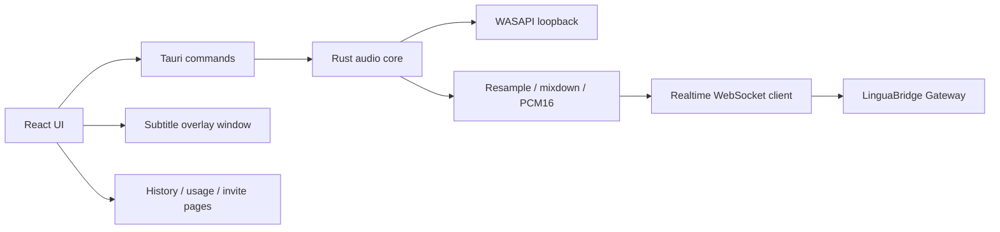
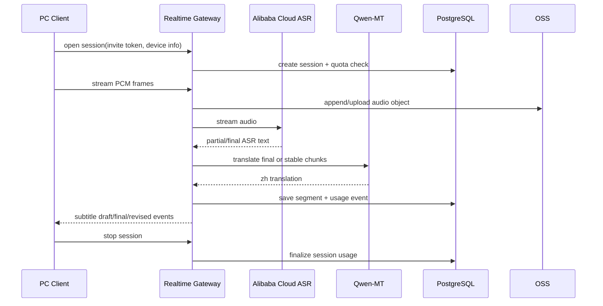

# LinguaBridge MVP 技术选型

版本：v0.1  
日期：2026-06-05  
关联文档：[MVP PRD](./prd-mvp-ai-realtime-subtitle.md)  
产品约束：Windows 10/11 PC 首发、系统音频录制、实时字幕纠错、阿里云模型、邀请码 + 用量统计、会话落盘

## 1. 结论

MVP 推荐技术栈：

| 层 | 推荐选型 | 说明 |
| --- | --- | --- |
| 桌面客户端 | Tauri v2 + React + TypeScript | 用 Web 技术快速做 UI，用 Rust 做系统能力；包体、权限面和后续原生音频扩展优于 Electron。 |
| Windows 音频采集 | Rust 原生模块 + WASAPI loopback | 直接捕获系统输出音频，不依赖浏览器或播放器。 |
| 音频处理 | Rust 音频管线，PCM16 16kHz mono 实时帧 | 捕获后统一转成阿里云实时模型更容易接受的低带宽格式。 |
| 实时网关 | TypeScript + Node.js 22 + Fastify + raw WebSocket | 负责客户端连接、阿里云模型转发、字幕状态机、落盘和用量统计。 |
| 模型链路 | 阿里云 ASR + Qwen-MT 为主，LiveTranslate 做 Spike | 先保证术语、纠错和可控性；LiveTranslate 用于验证低延迟同传链路。 |
| 数据库 | PostgreSQL | 存用户、邀请码、会话、字幕分段、用量事件和术语表。 |
| 对象存储 | 阿里云 OSS | 存音频文件、导出文件、后续解析产物。 |
| 缓存/限流 | Redis / 阿里云 Tair | 管在线会话、邀请码额度、限流和短期状态。 |
| 日志监控 | 阿里云 SLS + 应用指标 | 跟踪延迟、错误、模型成本、音频中断。 |
| 部署 | Alpha 阶段 ECS + Docker Compose；后续 ACK | Alpha 先降低运维复杂度，付费验证后再容器编排扩展。 |

一句话：**客户端用 Tauri 把 Windows 系统音频采集做稳，后端用轻量实时网关统一管模型、数据、成本和纠错，不让客户端直连阿里云。**

## 2. 为什么主推 Tauri 而不是 Electron

| 方案 | 优点 | 问题 | 结论 |
| --- | --- | --- | --- |
| Tauri v2 | 包体小，Rust 后端适合系统音频和低延迟处理；官方支持平台能力、权限能力和窗口能力；后续可扩展 macOS 原生采集。 | 团队需要 Rust/Windows 音频经验；部分桌面能力需要自己封装。 | 推荐作为主方案。 |
| Electron | Web 团队上手快，生态成熟，调试方便。 | 包体和内存更大；系统音频采集仍需原生模块；安全面更大。 | 作为备选，适合团队完全没有 Rust 能力时。 |
| 原生 Windows | 音频、窗口、托盘控制最稳定。 | MVP 研发速度慢，跨平台扩展成本高。 | 不建议第一版。 |

当前产品的关键不是普通 UI，而是系统音频采集、低延迟音频流、置顶字幕浮窗和后续 macOS 扩展。Tauri 的 Rust 后端更贴近这些底层能力，前端仍可用 React/TypeScript 快速实现产品界面。

## 3. 客户端技术方案

### 3.1 客户端模块



### 3.2 Windows 音频采集

推荐直接封装 WASAPI loopback：

- 捕获默认输出设备的系统音频。
- 监听输出设备变化，例如扬声器切换到蓝牙耳机。
- 统一转成 16kHz、mono、PCM16。
- 按 20-100ms 切帧发送到 Realtime Gateway。
- 保留短时本地 ring buffer，用于断线重传和本地缓存。

不建议第一版录麦克风。麦克风可作为 P1 的“会议学习/旁白备注”能力。

### 3.3 桌面窗口

客户端至少包含 3 类窗口：

| 窗口 | 说明 |
| --- | --- |
| 主窗口 | 登录、邀请码激活、历史会话、用量、术语表、设置。 |
| 字幕浮窗 | 置顶、可拖动、可锁定、可调透明度和字号。 |
| 托盘菜单 | 开始/停止、显示/隐藏字幕、打开主窗口、退出。 |

字幕浮窗需要重点验证：

- 普通窗口、浏览器全屏、播放器全屏下的置顶表现。
- 多显示器与 DPI 缩放。
- 鼠标穿透和锁定模式。
- 独占全屏游戏/播放器不作为 MVP 保证范围。

### 3.4 本地存储

| 数据 | 存储方式 |
| --- | --- |
| 登录 token | Windows Credential Manager 或等效安全存储。 |
| 客户端配置 | 本地 SQLite 或 Tauri store。 |
| 短期音频缓存 | App data 目录，按 session 分目录。 |
| 会话索引 | 本地 SQLite 缓存一份，云端 PostgreSQL 为准。 |

MVP 需要支持“删除会话”同时删除本地缓存和云端对象。

## 4. 后端技术方案

### 4.1 服务拆分

Alpha 阶段不用拆微服务，推荐一个 modular monolith：

| 模块 | 职责 |
| --- | --- |
| Auth & Invite | 邮箱/手机号登录、邀请码激活、额度初始化。 |
| Realtime Gateway | WebSocket 连接、音频帧接收、阿里云模型连接、字幕事件返回。 |
| Subtitle Engine | `draft/final/revised` 状态机、术语命中、上下文修订。 |
| Session Storage | 音频落盘、字幕分段、修订历史、导出文件。 |
| Usage Metering | ASR 时长、翻译 token、修订 token、OSS 存储、异常中断。 |
| Admin API | 邀请码批次、用户用量、成本统计、错误查看。 |

### 4.2 为什么后端用 TypeScript + Fastify

- 与 React/Tauri 前端共享类型，减少客户端/服务端协议错位。
- Fastify 足够轻，适合 HTTP API + raw WebSocket。
- 实时音频 WebSocket 更适合保持可控，不建议第一版把复杂实时流藏在重型框架里。
- 后续如果管理后台和业务复杂度明显上升，可以迁移到 NestJS 风格的模块组织，但 Alpha 不必先背框架重量。

### 4.3 Realtime Gateway 数据流



客户端不保存阿里云 API Key。所有模型调用都必须经过 Gateway，便于：

- 保护密钥。
- 统计成本。
- 做额度限制。
- 落盘音频与分段。
- 统一术语表和纠错策略。

## 5. 阿里云模型链路

### 5.1 推荐主链路

MVP 主链路先采用 **ASR + Qwen-MT**：

```text
System audio -> Gateway -> Realtime ASR -> stable segment -> Qwen-MT -> subtitle event
```

理由：

- 技术术语、领域提示和术语表更可控。
- 字幕分段、修订状态和 transcript 更可解释。
- 后续课后解析可以复用 ASR 原文、译文和修订历史。

### 5.2 必须 Spike 的备选链路

同时验证 **LiveTranslate 直连**：

```text
System audio -> Gateway -> qwen3.5-livetranslate-flash-realtime -> source + translation
```

如果它在真实课程样本中满足以下条件，可考虑切换为主链路：

- 稳态延迟比 ASR + MT 低 30% 以上。
- 可稳定返回原文和译文。
- 技术术语错误率不高于 ASR + MT。
- 支持足够清晰的分段和修订事件。

### 5.3 字幕事件协议

建议客户端与网关使用统一事件：

```json
{
  "type": "subtitle.segment.updated",
  "sessionId": "sess_001",
  "segmentId": "seg_001",
  "status": "draft",
  "sourceText": "We deploy it on Kubernetes",
  "targetText": "我们将它部署在 Kubernetes 上",
  "startAtMs": 12030,
  "endAtMs": 14880,
  "revision": 1,
  "termsHit": ["Kubernetes"],
  "latencyMs": 2200
}
```

状态流：

```text
draft -> final -> revised
```

实时 UI 只修订当前段和上一段；更早段落只更新历史 transcript。

## 6. 数据库与对象存储

### 6.1 PostgreSQL 表建议

| 表 | 核心字段 |
| --- | --- |
| `users` | id, email/phone, status, created_at |
| `invite_batches` | id, name, quota_minutes, max_uses, expires_at |
| `invites` | code_hash, batch_id, activated_by, activated_at, status |
| `sessions` | id, user_id, source_lang, target_lang, status, started_at, ended_at, duration_ms |
| `session_audio_objects` | session_id, oss_key, format, duration_ms, size_bytes |
| `subtitle_segments` | session_id, segment_id, start_ms, end_ms, source_text, target_text, status, revision |
| `segment_revisions` | segment_id, revision, source_text, target_text, reason, model_trace |
| `term_entries` | user_id, source, target, mode, aliases |
| `usage_events` | user_id, session_id, event_type, amount, unit, model, cost_estimate |

### 6.2 OSS 对象路径

```text
users/{userId}/sessions/{sessionId}/audio.opus
users/{userId}/sessions/{sessionId}/segments.json
users/{userId}/sessions/{sessionId}/exports/transcript.md
users/{userId}/sessions/{sessionId}/exports/subtitle.srt
```

MVP 默认保留 30 天。删除会话时需要删除：

- PostgreSQL 会话与分段数据。
- OSS 音频和导出文件。
- 后续解析索引。
- 本地客户端缓存。

## 7. 邀请码与用量统计

### 7.1 邀请码

邀请码不只是准入控制，也要成为内测分析维度。

| 能力 | MVP 要求 |
| --- | --- |
| 批次 | 支持按渠道/人群创建批次。 |
| 额度 | 每个批次可配置默认分钟数。 |
| 有效期 | 支持邀请码过期。 |
| 激活 | 一个邀请码默认只绑定一个用户。 |
| 后台 | 按批次看激活率、平均会话时长、成本、留存。 |

### 7.2 用量事件

所有成本相关数据都写成 append-only usage events，便于后续重算。

| 事件 | 单位 |
| --- | --- |
| `asr_audio_duration` | milliseconds |
| `mt_input_tokens` | tokens |
| `mt_output_tokens` | tokens |
| `revision_tokens` | tokens |
| `oss_audio_storage` | bytes |
| `session_realtime_duration` | milliseconds |
| `session_interruption` | count |

## 8. 部署选型

### 8.1 Alpha 部署

推荐：

- Alibaba Cloud ECS
- Docker Compose
- PostgreSQL: 阿里云 RDS PostgreSQL
- Redis: 阿里云 Tair 或 ECS 自建 Redis
- Object Storage: OSS
- Logs: SLS
- HTTPS: SLB/Nginx + TLS

Alpha 不建议一开始上 Kubernetes。实时 WebSocket、模型连接和成本统计先跑通，等到付费验证时再考虑 ACK。

### 8.2 环境

| 环境 | 用途 |
| --- | --- |
| `dev` | 本地开发，可使用 mock model provider。 |
| `staging` | 内测前验证真实阿里云模型与 OSS。 |
| `prod-alpha` | 邀请码用户使用。 |

## 9. 不推荐方案

| 方案 | 不推荐原因 |
| --- | --- |
| 客户端直连阿里云 | 暴露密钥，无法集中计费、限流、落盘和修订。 |
| 只做浏览器扩展 | 覆盖范围不满足“系统音频录制”的产品方向。 |
| 第一版就做 macOS + Windows | 音频采集权限和测试矩阵翻倍，影响 MVP 速度。 |
| 第一版就接正式支付 | 在模型成本、留存和字幕质量未验证前，会增加无效复杂度。 |
| 只保存最终字幕 | 无法做纠错评估、课后精读解析和翻译质量回溯。 |

## 10. Phase 0 技术 Spike

第一周必须做以下验证，结果决定最终实现细节：

| Spike | 验收标准 |
| --- | --- |
| WASAPI loopback capture | Windows 10/11 下浏览器、播放器、会议软件均可捕获；蓝牙耳机切换有可识别错误或自动恢复。 |
| 音频格式转换 | 输出 16kHz mono PCM16；连续 10 分钟无内存增长和明显丢帧。 |
| Tauri 字幕浮窗 | 普通窗口、浏览器全屏、播放器全屏可置顶；支持拖动、锁定、透明度。 |
| ASR + Qwen-MT 链路 | 5 段英文技术视频样本，P50 稳态字幕延迟 <= 4 秒。 |
| LiveTranslate 链路 | 与 ASR + MT 对比延迟、术语准确率、分段质量。 |
| 会话落盘 | 30 分钟音频和 segments 可完整落 OSS/PostgreSQL，并能删除。 |
| 邀请码 + 用量 | 可激活用户、扣减分钟额度、后台看每用户模型成本。 |

建议样本：

- AI/LLM 技术演讲。
- 前端框架教程。
- 云原生/Kubernetes 分享。
- 数据库/系统设计课程。
- 口音较重的英文 conference talk。

## 11. 最终推荐

MVP 采用：

```text
Tauri v2 + React + TypeScript
Rust WASAPI loopback audio core
TypeScript Fastify Realtime Gateway
Alibaba Cloud ASR + Qwen-MT, LiveTranslate Spike
PostgreSQL + OSS + Redis/Tair + SLS
ECS + Docker Compose for Alpha
```

这个方案的核心取舍是：**把底层音频和实时链路做稳，把商业验证需要的邀请码、用量、落盘和成本统计从第一版纳入，而不是先做看起来完整但不可计费、不可回溯的 Demo。**

## 12. 参考来源

- Tauri v2: [Official documentation](https://v2.tauri.app/)
- Electron: [Official documentation](https://www.electronjs.org/docs/latest/)
- Microsoft Learn: [Loopback Recording](https://learn.microsoft.com/en-us/windows/win32/coreaudio/loopback-recording)
- Alibaba Cloud Model Studio: [Speech-to-text models](https://www.alibabacloud.com/help/en/model-studio/asr-model/)
- Alibaba Cloud Model Studio: [Real-time audio and video translation - Qwen](https://www.alibabacloud.com/help/en/model-studio/qwen3-5-livetranslate-flash-realtime)
- Alibaba Cloud Model Studio: [Machine translation (Qwen-MT)](https://www.alibabacloud.com/help/en/model-studio/machine-translation)
- Apple Developer Documentation: [ScreenCaptureKit](https://developer.apple.com/documentation/screencapturekit)
