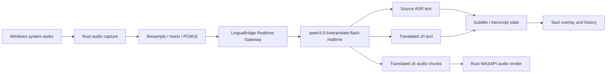
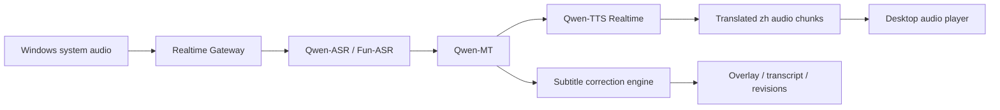

# LinguaBridge 同声传译功能实现规划

版本：v0.1  
日期：2026-06-06  
状态：第一版已按项目负责人确认开始实现；中文译音默认播放并随会话默认保存 30 天  
关联文档：[MVP PRD](./prd-mvp-ai-realtime-subtitle.md)、[MVP 技术选型](./technical-selection-mvp.md)、[MVP 实现说明](./notes-mvp-implementation.md)

## 1. 规划结论

同声传译能力可以在当前 Tauri + Rust + Realtime Gateway 架构上演进。项目负责人已确认先开发第一版：播放中文译音，中文译音音轨随会话默认保存 30 天。当前定位仍是实验能力，先跑通闭环并验证质量、成本和 Windows 音频回灌风险。

推荐第一阶段做两条链路对比：

| 链路 | 定位 | 结论 |
| --- | --- | --- |
| A. LiveTranslate 端到端链路 | 系统音频 -> Gateway -> `qwen3.5-livetranslate-flash-realtime` -> 中文文本 + 中文音频 | **优先 Spike**。官方文档显示该模型可通过 WebSocket 输入音频，并输出译文文本与译文音频；可配置源语言 ASR 原文返回。链路短，最适合验证同传体验。 |
| B. ASR + MT + TTS 拆分链路 | 系统音频 -> ASR -> Qwen-MT -> Qwen-TTS/CosyVoice | 作为备选和会后高质量链路。术语、纠错、缓存和回放控制更强，但实时延迟、失败点和编排复杂度更高。 |

第一技术风险不是模型接入，而是 **译音回灌**：LinguaBridge 播放的中文译音可能被 WASAPI loopback 再次捕获并送入模型，造成重复翻译、回声和成本浪费。第一版先用 Web Audio 播放中文译音以打通体验；后续必须优先验证 Windows 进程级 loopback 排除或音频路由隔离。具体实现拆分见 [Windows process-exclude loopback 实现规划](./technical-windows-process-exclude-loopback-plan.md)。

## 2. 最新联网依据

本规划按项目要求使用 `ctx7` CLI 获取当前文档，并通过官方页面链接核验关键资料。Firecrawl 搜索因额度不足失败，未作为依据。

已使用的官方/可信资料：

- 阿里云百炼实时音视频翻译：<https://help.aliyun.com/zh/model-studio/qwen3-5-livetranslate-flash-realtime>
- LiveTranslate 客户端事件：<https://help.aliyun.com/zh/model-studio/live-translator-client-events>
- LiveTranslate 服务端事件：<https://help.aliyun.com/zh/model-studio/live-translator-server-events>
- 阿里云语音识别模型：<https://help.aliyun.com/zh/model-studio/asr-model/>
- Qwen-ASR Realtime WebSocket：<https://help.aliyun.com/zh/model-studio/qwen-asr-realtime-interaction-process>
- Qwen-MT 翻译能力：<https://help.aliyun.com/zh/model-studio/machine-translation>
- Qwen-TTS Realtime：<https://help.aliyun.com/zh/model-studio/qwen-tts-realtime>
- 阿里云模型价格：<https://help.aliyun.com/zh/model-studio/model-pricing>
- 阿里云限流说明：<https://help.aliyun.com/zh/model-studio/rate-limit>
- Microsoft WASAPI Loopback Recording：<https://learn.microsoft.com/en-us/windows/win32/coreaudio/loopback-recording>
- Microsoft Application Loopback Sample：<https://learn.microsoft.com/en-us/samples/microsoft/windows-classic-samples/applicationloopbackaudio-sample/>
- Microsoft `PROCESS_LOOPBACK_MODE`：<https://learn.microsoft.com/en-us/windows/win32/api/audioclientactivationparams/ne-audioclientactivationparams-process_loopback_mode>
- Microsoft process loopback params：<https://learn.microsoft.com/en-us/windows/win32/api/audioclientactivationparams/ns-audioclientactivationparams-audioclient_process_loopback_params>
- Tauri v2 Global Shortcut：<https://v2.tauri.app/plugin/global-shortcut/>
- Tauri v2 Calling Rust：<https://v2.tauri.app/develop/calling-rust/>
- Tauri v2 Window API：<https://v2.tauri.app/reference/javascript/api/namespacewebviewwindow/>

## 3. 产品定位

同声传译不是“实时字幕的自然开关”，它会改变产品体验、成本和隐私边界。建议定义为独立模式：

| 模式 | 用户价值 | 默认状态 |
| --- | --- | --- |
| 字幕伴学 | 实时英文原文 + 中文字幕 + 自动纠错 + 课后 transcript | MVP 默认模式 |
| 同声传译 | 在字幕之外播放中文译音，降低用户盯字幕的负担 | 第一版实验模式，默认播放中文译音 |
| 同传 + 原声压低 | 播放中文译音时自动降低源视频音量 | 高风险实验选项，默认关闭 |
| 同传复盘音轨 | 会后生成完整中文音轨，可与 transcript 一起回放 | P1/P2，适合拆分链路或非实时 TTS |

建议首个实验只面向英文技术内容 -> 简体中文，不扩大到多语种和会议双向口译。

## 4. 推荐架构

### 4.1 端到端 LiveTranslate Spike



会话建议：

- `modalities`: `["text", "audio"]`
- `input_audio_format`: `pcm`
- `output_audio_format`: `pcm`
- `sample_rate`: `16000`
- `input_audio_transcription.model`: `qwen3-asr-flash-realtime`
- `input_audio_transcription.language`: `en`
- `translation.language`: `zh`
- 术语：通过 LiveTranslate 支持的热词/语料能力传入技术词；客户端展示前对中文文本做简繁规范化。

Gateway 仍然是唯一云模型调用方，客户端不得直连阿里云。

### 4.2 ASR + MT + TTS 备选链路



适用场景：

- 需要强术语控制和字幕纠错。
- 需要缓存 MT 结果，减少重复 TTS。
- 需要会后生成更自然的中文音轨。
- LiveTranslate 分段、术语或输出音频质量不满足产品要求。

不建议作为第一条同传主链路，因为三段模型编排会显著增加延迟、错误处理和成本统计复杂度。

## 5. 客户端实现规划

### 5.1 音频捕获

现有 WASAPI loopback 采集可复用，但同声传译需要新增捕获模式：

| 捕获模式 | 适用系统 | 用途 |
| --- | --- | --- |
| Endpoint loopback | Windows 10/11 全量 | 当前字幕模式；会捕获系统混音，包括 LinguaBridge 自己播放的译音。 |
| Process-exclude loopback | Windows 10 Build 20348+ / Windows 11 优先验证 | 同传推荐模式；排除 LinguaBridge 进程树，避免译音回灌。 |
| 虚拟音频设备路由 | 旧 Windows 10 或高级用户 | 通过 VB-CABLE/VoiceMeeter 等隔离源音频和译音，操作成本高。 |

正式内测前必须探测系统版本和 API 可用性。第一版已按需求默认播放中文译音，但会明确标注 Web Audio 播放存在回灌风险；稳定版本应在无法排除自身进程时降级为字幕模式或要求用户选择高级音频路由。

process-exclude loopback 已拆成独立规划：同传稳定版应新增 `ActivateAudioInterfaceAsync` + `AUDIOCLIENT_ACTIVATION_TYPE_PROCESS_LOOPBACK` 捕获路径，并用 `PROCESS_LOOPBACK_MODE_EXCLUDE_TARGET_PROCESS_TREE` 排除 LinguaBridge 进程树。最低系统要求 Windows 10 Build 20348；旧 Windows 10 默认不应进入“播放译音 + endpoint loopback”的危险组合。

### 5.2 译音播放

稳定版译音播放应放在 Rust 原生层，而不是 WebView/WebAudio。第一版为尽快打通闭环，先在桌面 WebView 中用 Web Audio 排队播放 Gateway 返回的 PCM：

- 使用 WASAPI shared render 播放模型返回的 PCM 音频块。
- 维护独立播放缓冲，处理抖动、断帧、重连和 stop flush。
- 提供译音音量滑杆，不修改系统主音量。
- 可选播放设备：默认输出设备、默认通信设备或用户指定设备。
- 播放进程必须在可被 process-exclude loopback 排除的进程树内。

### 5.3 原声压低和混音

原声压低是体验选项，不是第一版默认能力。

| 方案 | 结论 |
| --- | --- |
| Windows 自带通信 ducking | 可 Spike，但体验受系统策略影响，不适合默认依赖。 |
| 自定义调低其它 audio session 音量 | 可做，但必须保存并恢复原值；崩溃后不能污染用户音量状态。 |
| 降低主音量 | 禁止。用户信任风险太高。 |
| 不压低原声，仅调译音音量 | 第一版推荐默认。 |

## 6. Gateway 实现规划

### 6.1 新增会话模式

现有 `session.start` 需要扩展为能力协商，而不是直接把字幕会话改成同传会话。

建议新增字段：

```ts
type RealtimeMode = "subtitle" | "interpretation";

type InterpretationOptions = {
  outputAudio: boolean;
  outputText: true;
  playbackDeviceId?: string;
  sourceDucking: "off" | "system" | "session";
  echoAvoidance: "process_exclude" | "separate_device" | "disabled";
};
```

如果 `mode = "interpretation"` 且客户端不支持 `process_exclude` 或单独设备路由，Gateway 可以拒绝输出音频，只返回字幕。

### 6.2 新增服务端事件

建议保持字幕事件不变，新增解释音频事件：

```ts
type InterpretationAudioDeltaEvent = {
  type: "interpretation.audio.delta";
  version: 1;
  payload: {
    sessionId: string;
    trackId: string;
    sequence: number;
    pcmBase64: string;
    sampleRate: number;
    channels: 1;
    sampleFormat: "pcm_s16le" | "pcm_s24le";
    durationMs: number;
    sourceSegmentId?: string;
    latencyMs: number;
    modelTrace: ModelTrace;
  };
};

type InterpretationAudioCompletedEvent = {
  type: "interpretation.audio.completed";
  version: 1;
  payload: {
    sessionId: string;
    trackId: string;
    totalDurationMs: number;
  };
};
```

字幕文本仍走 `subtitle.segment.updated`，以便复用浮窗、历史会话、导出和修订逻辑。

### 6.3 Provider 抽象

当前 `RealtimeModelSession` 以字幕输出为核心。建议新增或扩展为多模态输出：

```ts
interface RealtimeInterpretationSession {
  start(callbacks: InterpretationCallbacks): Promise<void>;
  appendAudioFrame(frame: RealtimeAudioFramePayload): Promise<void>;
  stop(): Promise<void>;
}

interface InterpretationCallbacks {
  onSourceText(event: AsrTextEvent): Promise<void>;
  onTranslatedText(event: TranslatedTextEvent): Promise<void>;
  onTranslatedAudio(event: TranslatedAudioDeltaEvent): Promise<void>;
  onUsageEvent(event: RealtimeModelUsageEvent): void;
  onProviderError(error: SubtitleProviderError): void;
}
```

建议先新增 `AlibabaCloudLiveTranslateSession`，不要把它硬塞进当前 `SubtitleEngine`。等 Spike 后再判断是否抽象成统一 `RealtimeMediaSession`。

## 7. 数据与落盘

同声传译会新增中文音频产物，需要扩展会话 artifacts：

```text
users/{userId}/sessions/{sessionId}/audio-source.pcm
users/{userId}/sessions/{sessionId}/audio-interpretation.pcm
users/{userId}/sessions/{sessionId}/segments.json
users/{userId}/sessions/{sessionId}/tracks/interpretation.json
users/{userId}/sessions/{sessionId}/exports/transcript.md
users/{userId}/sessions/{sessionId}/exports/interpretation.wav
```

数据库建议新增：

| 表/字段 | 用途 |
| --- | --- |
| `realtime_sessions.mode` | 区分 `subtitle` 与 `interpretation`。 |
| `session_audio_objects.kind` | `source_audio`、`interpretation_audio`、`export_audio`。 |
| `usage_events.event_type` | 新增 `livetranslate_input_audio_tokens`、`livetranslate_output_audio_tokens`、`livetranslate_output_text_tokens` 或统一 `model_audio_input_tokens` 等。 |
| `segment_revisions.model_trace` | 记录 LiveTranslate / ASR+MT+TTS 来源，便于质量对比。 |

隐私授权文案已更新：用户不仅上传系统音频，还会生成和保存中文译音音轨。中文译音音轨随会话默认保存 30 天。删除会话时必须同时删除源音频、译音音频、文本、导出文件和后续索引。

## 8. 成本估算

基于 2026-06-06 官方价格页公开信息，LiveTranslate 粗略成本如下：

| 项目 | 官方口径 | 粗估 |
| --- | --- | --- |
| 输入音频 | 40 元 / 百万 Token；音频约 7 Token/s | 约 0.0168 元/分钟 |
| 输出音频 | 160 元 / 百万 Token；音频约 12.5 Token/s | 约 0.12 元/分钟 |
| 输出文本 | 100 元 / 百万 Token | 与文本量相关，另计 |
| 合计 | 不含输出文本、图像、存储和网络 | 仅音频约 0.137 元/分钟 |

拆分链路参考：

- Qwen-ASR Realtime：公开价格示例约 0.00033 元/秒，约 0.0198 元/分钟。
- Qwen-MT Flash：按输入/输出 token 计费，技术课程每分钟通常低于同传音频输出成本。
- Qwen-TTS Realtime：按字符计费，中文译音字符数与语速强相关。

成本结论：同传的主要增量成本来自 **输出音频**。Alpha 阶段必须设置独立用量统计和实验额度，不应复用当前“字幕分钟数”单一口径。

## 9. 风险清单

| 风险 | 影响 | 处理 |
| --- | --- | --- |
| 译音回灌 | 重复翻译、回声、成本失控 | 第一版先提示风险；下一步优先实现 process-exclude loopback；旧 Win10 稳定版应禁用译音或要求高级路由。 |
| 延迟过高 | 同传体验失败 | LiveTranslate 与拆分链路同样本对比；P50 目标 <= 4 秒，P95 <= 7 秒。 |
| 术语漂移 | 技术学习场景价值下降 | 热词/语料 + 字幕后处理 + 会后精修；术语指标单独评测。 |
| 简中不可精确指定 | 文本可能出现非预期字形 | 模型侧用 `zh`，展示/落盘前做简繁规范化。 |
| 音频播放缓冲不稳 | 卡顿、断续、重叠 | Rust 原生播放器和 jitter buffer；记录 underrun。 |
| 原声压低污染系统音量 | 用户信任受损 | 第一版默认关闭；只调 audio session 且可恢复。 |
| 并发/限流不确定 | 内测时模型报错 | 控制台确认额度；Gateway 做模型错误降级与重试。 |
| 隐私边界扩大 | 合规与用户信任风险 | 单独授权、明显状态提示、完整删除链路。 |

## 10. Spike 计划

### Spike 1：LiveTranslate 文本 + 音频闭环

目标：Gateway 接入 `qwen3.5-livetranslate-flash-realtime`，客户端收到中文文本和中文音频。

验收：

- 同一段英文技术视频可返回英文原文、中文译文和中文音频。
- 中文音频可在本地播放，stop 后缓冲清空。
- 记录首句延迟、稳态延迟、音频 underrun 次数、模型错误。
- 不改现有字幕模式默认路径。

### Spike 2：译音回灌规避

目标：验证 Windows 11 / Windows 10 Build 20348+ 的 process-exclude loopback。

验收：

- 播放源视频 + LinguaBridge 中文译音时，捕获流不包含或极低包含自身译音。
- Win10 19045 明确 fallback 行为。
- 设备切换、蓝牙耳机、默认输出变化均有可解释状态。

详细实施顺序：先做客户端能力探测与降级状态，再做 process loopback activation spike，最后把同传默认捕获切到 process-exclude。

### Spike 3：术语与质量对比

目标：对比 LiveTranslate 与 ASR + MT + TTS。

样本：

- AI/LLM 技术演讲。
- 前端框架教程。
- Kubernetes / 云原生分享。
- 数据库或系统设计课程。

指标：

- P50/P95 延迟。
- 术语一致率。
- 可理解度人工评分。
- 字幕分段质量。
- 每分钟模型成本。

### Spike 4：产品体验验证

目标：验证同传是否真的提升学习体验，而不是干扰。

验收：

- 用户可一键切换“只字幕”和“字幕 + 中文译音”。
- 译音音量独立可调。
- 原声压低默认关闭。
- 浮窗清楚展示同传状态、延迟和错误。
- 结束后历史会话可查看文字 transcript 和译音音轨。

## 11. 分阶段路线

| 阶段 | 范围 | 交付 |
| --- | --- | --- |
| P1-S0 调研确认 | 产品范围、成本、隐私、系统兼容性确认 | 本文档 + 项目负责人决策 |
| P1-S1 技术 Spike | LiveTranslate adapter、音频播放、process-exclude loopback | 本地可跑 demo，不开放给 Alpha 用户 |
| P1-S2 内部实验 | 5-10 个样本评测，记录延迟/质量/成本 | 对比报告和是否继续投入建议 |
| P1-S3 Alpha 开关 | 邀请码实验批次可开启同传 | 独立用量、独立授权、可灰度关闭 |
| P2 正式化 | 稳定播放器、会后译音导出、音频路由增强 | 可作为 Pro 功能候选 |

## 12. 确认状态与剩余问题

已确认：

1. 第一版同传必须播放中文语音。
2. 中文译音音轨允许保存，默认保留 30 天。
3. 客户端仍不得直连阿里云；所有模型调用必须经过 Realtime Gateway。

仍需项目负责人后续确认：

1. Alpha 同传实验是否设置单独分钟额度或成本上限？
2. 对 Windows 10 旧版本用户，稳定版是否接受“无法安全避免回灌时禁用译音播放”？
3. 是否允许用户安装或配置 VB-CABLE / VoiceMeeter 这类虚拟音频设备作为高级模式？
4. 原声压低是否属于后续必需体验？如果需要，是否接受它作为默认关闭的实验开关？
5. 是否允许在未来引入可选屏幕图像帧给 LiveTranslate 增强理解？这会扩大隐私授权范围和成本。
